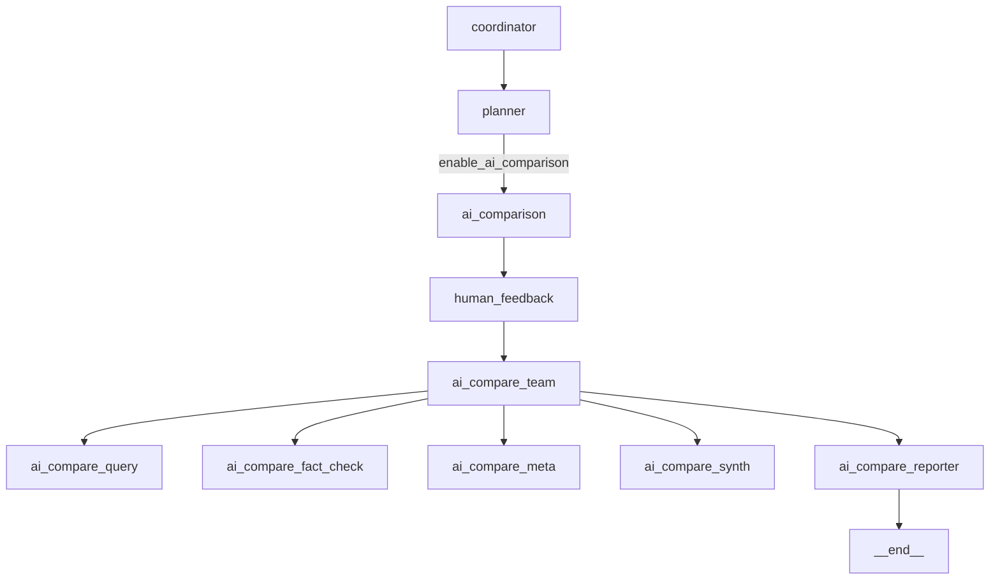
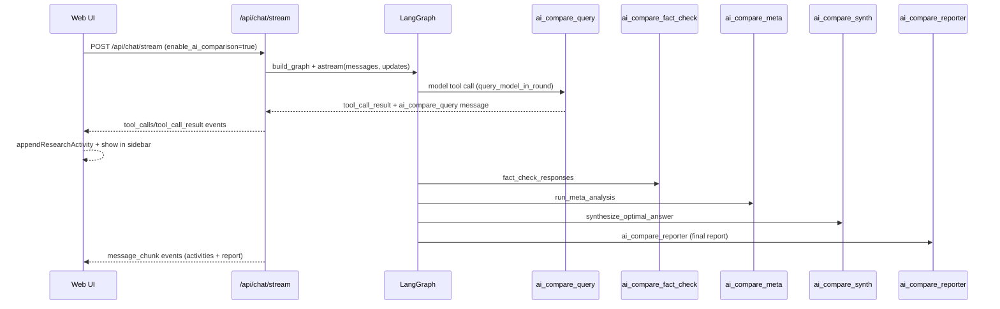

AI Comparison (DeerFlow) - End-to-end Analysis
================================================

Scope
-----
This document maps the AI comparison flow (backend LangGraph + frontend sidebar),
identifies external API calls, highlights known issues, and proposes concrete
improvements. It also includes a sequence/flow diagram for the AI comparison
chain as requested.

Key entry points
----------------
Backend:
- POST /api/chat/stream (backend/deer_flow/server/app.py)
  - request.enable_ai_comparison -> ReportStyle.AI_COMPARISON
  - state.enable_ai_comparison = true

Frontend (web app):
- web/src/core/api/chat.ts -> chatStream() -> SSE events
- web/src/core/store/store.ts -> appendMessage(), appendResearchActivity()
- web/src/app/chat/components/research-activities-block.tsx (sidebar activities)

High-level LangGraph flow (AI comparison)
-----------------------------------------
Coordinator and planner routing (simplified):
1) coordinator -> planner
2) planner sees enable_ai_comparison -> routes to ai_comparison
3) ai_comparison builds a fixed comparison plan (per model + fact check + meta + synthesis + report)
4) human_feedback (plan accept) -> ai_compare_team
5) ai_compare_team -> ai_compare_query -> ai_compare_fact_check -> ai_compare_meta -> ai_compare_synth -> ai_compare_reporter -> __end__

Mermaid flowchart (LangGraph nodes relevant to AI comparison)
-------------------------------------------------------------

Mermaid sequence diagram (backend -> frontend -> sidebar)
--------------------------------------------------------

External API calls (AI comparison + dependencies)
-------------------------------------------------
The AI comparison chain depends on both LLM providers and search/RAG tools.
Below is a consolidated view of external calls, configuration, and auth:

LLMs
----
- OpenAI (ChatOpenAI)              -> OPENAI_API_KEY
  Endpoint: https://api.openai.com/v1 (default in ChatOpenAI)
- Google GenAI (ChatGoogleGenerativeAI) -> GOOGLE_API_KEY
  Endpoint: Google Generative Language API (internal to SDK)
- DeepSeek (ChatDeepSeek)          -> DEEPSEEK_API_KEY
  Endpoint: DeepSeek chat API (SDK default)
- xAI (ChatOpenAI + base_url)      -> XAI_API_KEY, XAI_BASE_URL (default https://api.x.ai/v1)
- Local vLLM (ChatOpenAI)          -> VLLM_URL (default http://localhost:8000/v1), VLLM_MODEL

Search / Fact-check
-------------------
- Tavily Search API                -> TAVILY_API_KEY
  Endpoint: {TAVILY_API_URL}/search (default in langchain_tavily)
- InfoQuest Search API             -> INFOQUEST_API_KEY
  Endpoint: https://search.infoquest.bytepluses.com
- Brave Search                     -> BRAVE_SEARCH_API_KEY
- Google Serper                    -> SERPER_API_KEY
- Searx                            -> configured Searx instance (no auth if open)
- Wikipedia / Arxiv                -> public endpoints, no auth
- Crawl tool                        -> fetches URL content directly (network dependency)

RAG / Retrieval
---------------
- Local resources via retriever_tool (when resources present)
- External vector DBs if configured:
  - Milvus (langchain_milvus)
  - Qdrant (langchain_qdrant)

Notes on rate limits
--------------------
- OpenAI / Google / DeepSeek / xAI have provider rate limits; concurrency should be
  coordinated (e.g., batching or backoff on 429 responses).
- Tavily / Serper / Brave / InfoQuest have request quotas and may throttle.
- The current AI comparison flow queries models sequentially; this reduces peak
  concurrency but increases overall latency.

Why AI comparison behaves differently from debate
-------------------------------------------------
Debate flow:
- Uses debate_flow + external_ai_caller with explicit round orchestration.
- Sidebar uses debate activities block that renders tool results directly.

AI comparison flow:
- Uses ai_compare_query + follow-up nodes for fact-check/meta/synth/report.
- Each model response is produced as BOTH:
  - Tool call result (query_model_in_round), and
  - A separate ai_compare_query message with markdown content.

This dual-path is OK, but it can cause duplication in the sidebar if the tool
call result is rendered alongside the ai_compare_query message.

Bug: duplicate model responses in sidebar
----------------------------------------
Symptom:
- For AI comparison, a model response could appear twice in the Activities tab.

Root cause:
- tool_call_result for query_model_in_round can carry the same markdown response
  as the ai_compare_query message.
- Sidebar rendering would show both if the tool call is not recognized as
  "AI compare" (e.g., missing tool args in the tool call message).

Fix implemented (see commit)
----------------------------
- Tightened AI compare tool detection in
  web/src/app/chat/components/research-activities-block.tsx
- For query_model_in_round and model-query tools, the accordion now hides the
  tool_call_result body and shows a short note instead.
- This prevents the same model response from rendering twice.

Implemented optimizations (this branch)
--------------------------------------
- Parallel model queries via query_all_models (AI_COMPARE_PARALLEL_QUERY=true).
- Parallel web_search + RAG fetch in fact-checking.
- TTL caches for:
  - Model responses (AI_COMPARE_MODEL_CACHE_TTL_S)
  - Web search results (AI_COMPARE_SEARCH_CACHE_TTL_S)
  - RAG results (AI_COMPARE_RAG_CACHE_TTL_S)
  - Meta analysis (AI_COMPARE_META_CACHE_TTL_S)
  - Synthesis (AI_COMPARE_SYNTH_CACHE_TTL_S)
- Retry + timeout with exponential backoff for model calls:
  - AI_COMPARE_REQUEST_TIMEOUT_S
  - AI_COMPARE_MAX_RETRIES
  - AI_COMPARE_BACKOFF_BASE_S

Concrete UX + code improvements (next steps)
--------------------------------------------
1) Parallelize model queries:
   - AI comparison currently queries models sequentially in ai_compare_query_node.
   - Use asyncio.gather (similar to backend/ai_comparison_flow.py) to reduce
     total latency.

2) Caching:
   - Cache model responses keyed by (model_key, query_hash).
   - Cache web_search results for identical queries in the same session.

3) Consistent tool call naming:
   - Always emit "query_model_in_round" for AI comparison tool calls, and keep
     tool args intact to avoid UI ambiguity.

4) Error handling:
   - Surface model errors in a structured UI block (e.g., per-model error badge).
   - Add retry/backoff for provider 429/5xx.

5) Sidebar UX:
   - Add per-model status badges (Running/Done/Error) next to model names.
   - Add a compact "Compare" summary card with model list + response length.

6) Observability:
   - Log tool_call_id + model_key in ai_compare_query_node to enable traceability.
   - Emit per-model latency metrics in tool_call_result for UI display.

